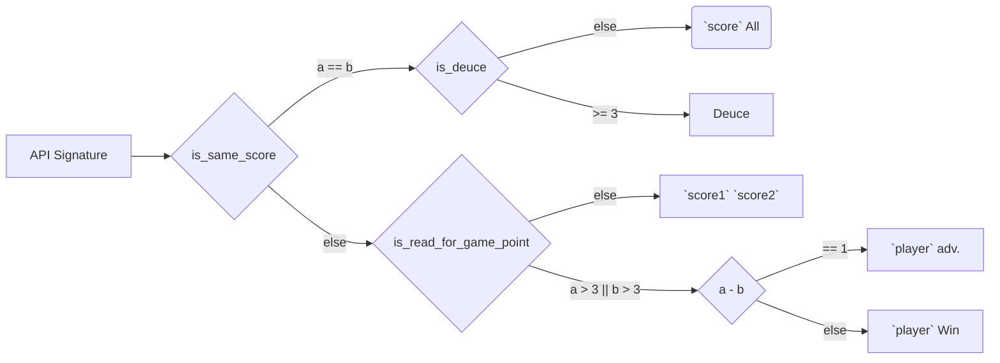
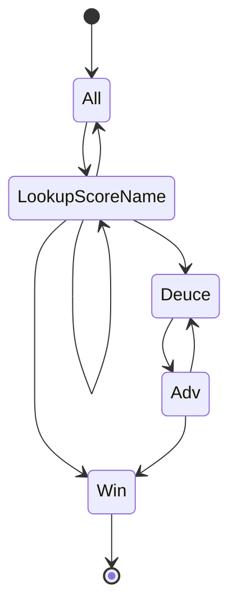

# TDD Unit Test

## Tennis

網球比賽的計分程式

初始的分數：0:0

Henry | Jack | Score() | Remark
--- | --- | --- | ---
0 | 0 | Love All | 兩人同分就會是 All, 0分就是 Love
1 | 0 | Fifteen Love | 1分就是 Fifteen
0 | 1 | Love Fifteen | 1分就是 Fifteen
1 | 1 | Fifteen All | 1分就是 Fifteen
2 | 3 | Thirty Forty | 2分就是 Thirty, 3分就是 Forty
4 | 1 | Henry Win | 4分且分數差2以上就是 Win
3 | 3 | Deuce | 3分平手開始就是 Deuce
3 | 4 | Jack adv. | Deuce 後分數差1就是 adv.
3 | 5 | Jack Win | Deuce 後分數差2就是 Win
10 | 10 | Deuce | >= 3分且分數相同就是 Deuce

### IPO Model

(To be filled)

### Logic Tree Diagram



### State Machine



### Test Cases

| Input | Output | Description |
| --- | --- | --- |
| 0:0 | Love All | API Signature 有初始化成功 |
| 1:0 | Fifteen Love | player1 得分 |
| 2:0 | Thirty Love | 得分對照表可正常顯示得 2 分 |
| 3:0 | Forty Love | 得分對照表可正常顯示得 3 分 |
| 0:1 | Love Fifteen | player2 得分 |
| 0:2 | Love Thirty | 得分對照表可正常顯示得 2 分 |
| 0:3 | Love Forty | 得分對照表可正常顯示得 3 分 |
| 1:1 | Fifteen All | 兩人同分時會顯示得分加 All |
| 2:2 | Fifteen All | 兩人同分時會顯示得分加 All |
| 3:3 | Deuce | 兩人都得 3 分時會顯示 Deuce |
| 4:3 | Henry adv. | player1 > 3分時會顯示 adv. |
| 3:4 | Jack adv. | 可以正確顯示領先的 player 名稱 |
| 3:5 | Jack Win | 測分數相差 > 1 時會顯示 Win |
| 4:2 | Henry Win | 測沒有 deuce 且分數相差 > 1 時會顯示 Win |

## FizzBuzz

```ruby
y = f(x)
# given y is a string, x is a integer
```

1. x 可被 3 整除時回傳 "fizz"
2. x 可被 5 整除時回傳 "buzz"
3. x 包含 3 時也要回傳 "fizz"
4. x 包含 5 時也要回傳 "buzz"
5. x 為 0 時回傳 "0"
6. (可以再多加上 7 的倍數回傳 "whizz" 之類的進階需求)

## Budget Query

1. 給定一段日期範圍，程式回傳該時間段內的預算金額(Decimal 或 Double)。
2. 時間範圍大小沒有限制
3. 預算資料從 DB 來，會有人 update 預算資料
4. 該時間範圍段內沒預算資料時回傳 0
5. 起始日期 > 結束日期回傳 0
6. 起始日期 = 結束日期回傳當天的預算金額

### DB Schema

| Column | Type | Example |
| --- | --- | --- |
| YearMonth | char6 | 202401 |
| Amount | integer | 1000 |

### Test Cases

| YearMonth | Amount |
| --- | --- |
| 202401 | 310 |
| 202402 | 2900 |

Note: 在寫測試時盡量讓資料的值不要重覆，假如 2 月是 290 的話，每日平均就跟 1 月一樣都是 10 元，有可能會讓測試明明有 bug 但還是通過。

| Start | End | Output | Description |
| --- | --- | --- | --- |
| 20240101 | 20240131 | 310 | 查一整個月的預算 |
| 20240101 | 20240101 | 10 | 查單一一天的預算 |
| 20240130 | 20240205 | 520 | 查跨兩個月的預算 |
| 20240131 | 20240101 | 0 | 起日大餘迄日 |
| 20241201 | 20241231 | 0 | 查詢月份沒有預算資料 |
| 20240130 | 20240305 | 2920 | 查跨 3 個月的資料，且其中一個月沒資料 |

## Note

1. 如果都可以完成同樣一件事，method 傳入的參數越少越好(Kent Beck)
2. TDD 在解構需求時只先看 input, output，先不看裡面的 process (實作)
3. 以每個測試案例之間最多只加一個 if 的順序來加測試
4. test first 不是 TDD 的重點，think first 才是
5. TDD 先專注在完成主幹的 test case，以比較複雜的需求來說可能是串接 DB, 第三方 API 等等。主幹完成後才去長 if-else 的條件判斷的 test case。(迭代式的產品增量)
6. Refinement Meeting 盡量全員到齊討論 `驗收情境`，並用實例化需求來確認需求的 spec。

## 補充資料

1. [Coding Ninjas](https://www.codingninjas.com/)
2.
